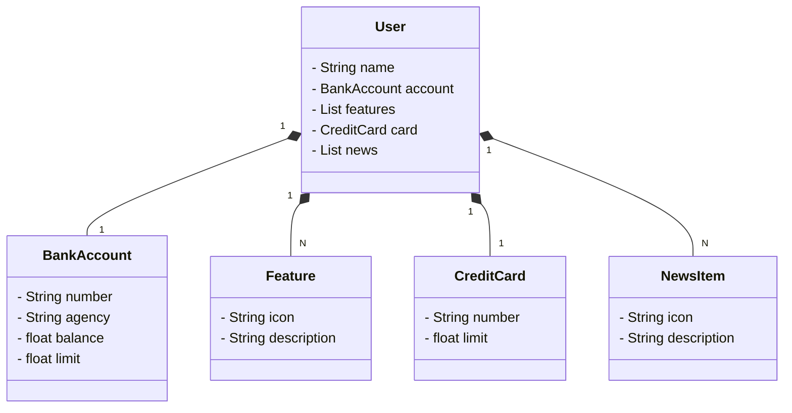

# santander-dev-work-2024

##Diagrama de Classe

```mermaid
classDiagram
  class User {
    - String name
    - BankAccount account
    - List<Feature> features
    - CreditCard card
    - List<NewsItem> news
  }

  class BankAccount {
    - String number
    - String agency
    - float balance
    - float limit
  }

  class Feature {
    - String icon
    - String description
  }

  class CreditCard {
    - String number
    - float limit
  }

  class NewsItem {
    - String icon
    - String description
  }

  User "1" *-- "1" BankAccount
  User "1" *-- "N" Feature
  User "1" *-- "1" CreditCard
  User "1" *-- "N" NewsItem
```
